[总结自：【狂神说Java】Docker最新超详细版教程通俗易懂](https://www.bilibili.com/video/BV1og4y1q7M4)

# Docker 概述

## Docker 出现的背景

发布产品时，每台机器都要部署环境，费时费力。因此开发人员来开发项目，专门的运维人员来进行环境的配置和项目部署（DevOps）。

但Docker 允许让`项目和环境`打包发布，省去环境部署的麻烦。


## Docker 历史

2010 年，几个搞IT的年轻人，在美国成立了一家公司``dotCloud`，做pass的云计算服务！LXC 有关的容器技术！他们将自己的技术（容器化技术）命名为Docker。Docker刚诞生，没有引起行业的注意。于是dotCloud活不下去了！

2013年`开源` => 火了，很多人发现了Docker 的优点！几乎每个月都会更新一个版本。

2014年4月，`Docker 1.0` 发布。


> 聊聊Docker

Docker 是基于Go语言开发的开源项目。

官网：[https://www.docker.com/](https://www.docker.com/)

文档地址：[https://docs.docker.com/](https://docs.docker.com/)

仓库地址：[https://hub.docker.com/](https://hub.docker.com/)


## Docker 能干嘛

> 之前的虚拟机技术

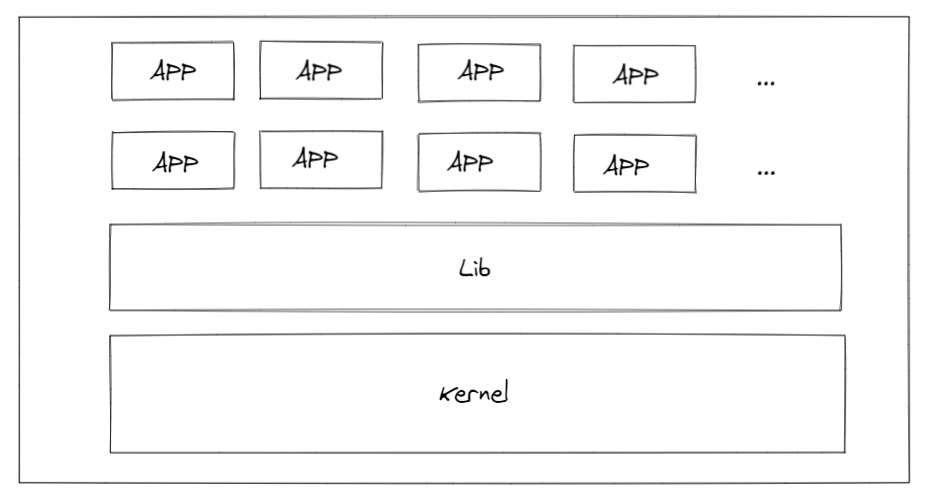

**虚拟机技术的缺点：**

1. 资源占用十分多
2. 冗余步骤多
3. 启动很慢

> 容器化技术

**容器化技术不是模拟一整个完整的操作系统**

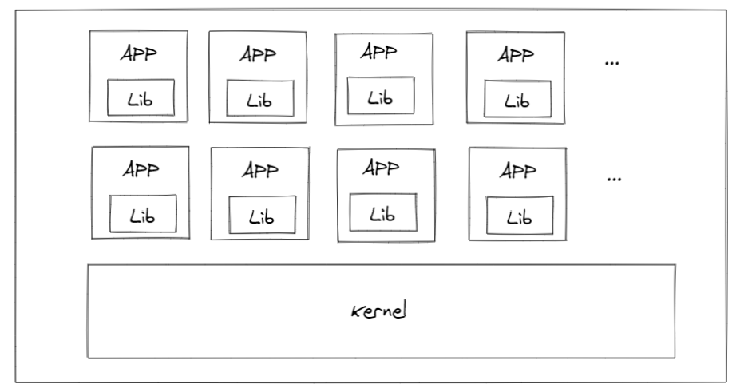

**比较Docker和虚拟机技术的不同**

- 传统虚拟机，虚拟出一套硬件，运行一个完整的操作系统，然后在这个操作系统上安装和运行软件。
- 容器内的应用直接运行在虚拟机的内核，容器是没有自己的内核的，也没有虚拟硬件，因此轻便。
- 每个容器间互相隔离，每个容器都有一个属于自己的文件系统，互不影响。

> DevOps （开发、运维）

1. 更快速的交付和部署（Docker：打包镜像发布测试，一键运行）
2. 更快捷的升级和扩缩容（部署应用就像搭积木，升级只需要更换镜像）
3. 更简单的系统运维（不会存在环境不一致问题）
4. 更高效的计算机资源利用（Docker是内核级的虚拟化，可以在一个物理机上运行很多的容器实例）


# Docker 安装

## Docker 基本组成

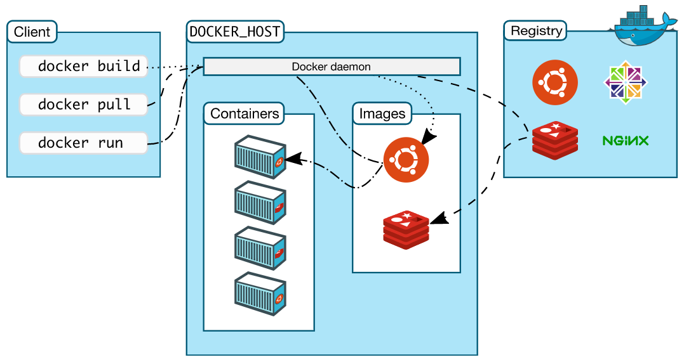

**镜像（image）**

Docker 镜像就好比一个模板，可以通过这个模板来创建容器服务。

**容器（container）**
Docker 利用容器技术，独立运行一个或者一个组应用。

启动，停止，删除等基本命令！（简单不恰当理解：简易的Linux系统）

**仓库（repository）**

仓库就是存放镜像的地方（Docker Hub）！


## 安装 Docker

## 测试 hello-world

> docker run hello-world
>
> docker images

## 回顾hello-world流程

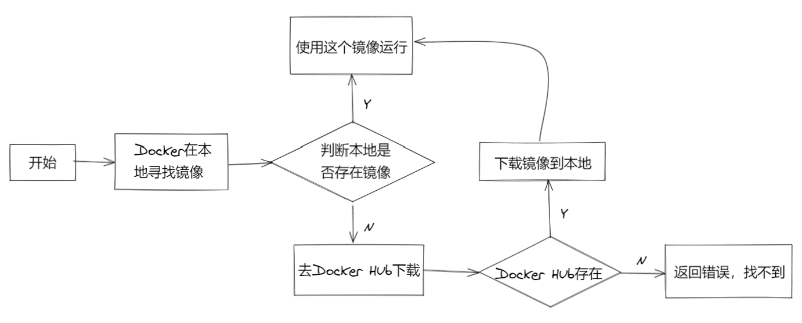

## 底层原理

**Docker 是怎么工作的？**

Docker 是一个Client-Server架构的系统，Docker的守护进程运行在主机上，通过Socket从客户端访问！

Docker-Server接收到Docker-Client的指令，就会执行这个命令！

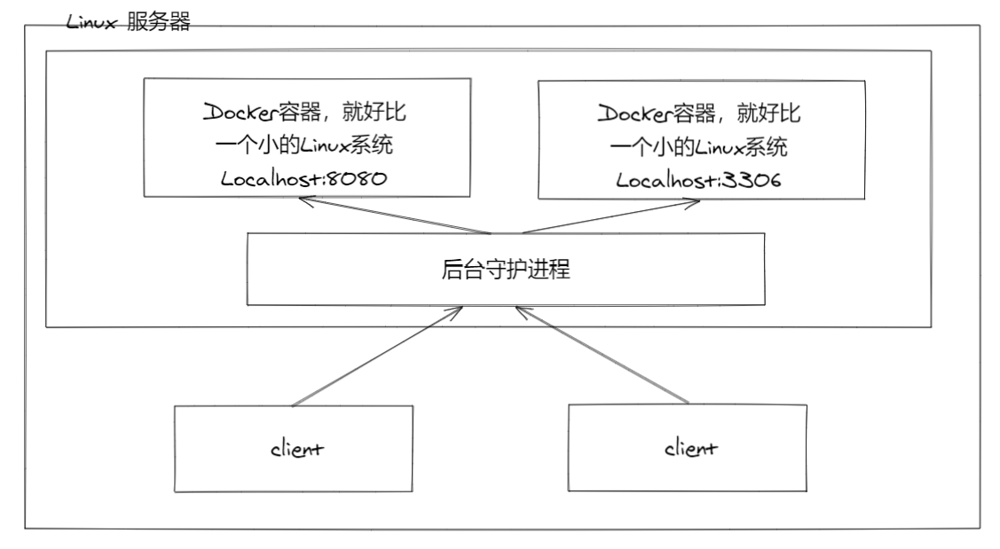

**Docker 为什么比 VM 快？**

1. Docker 有着比虚拟机更少的抽象层
2. Docker 利用的是宿主主机的内核，vm 需要的是 Guest OS.

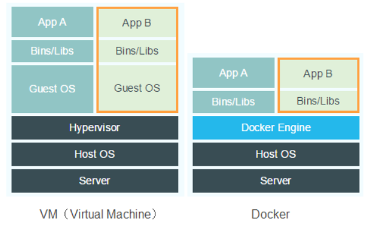

所以说，新建一个容器的时候， Docker不需要像虚拟机一样重新加载一个操作系统内核。虚拟机时加载Guest OS，分终级别！。而Docker是利用宿主机的操作系统，省略这个复杂的过程，秒级！

# Docker 常用命令

## 帮助命令

```shell
docker version		# 显示docker的版本信息
docker info			# 显示docker的系统信息，包括镜像和容器的数量
docker 命令 --help   # 万能命令
```

帮助文档地址：[https://docs.docker.com/reference/](https://docs.docker.com/reference/)


## 镜像命令

**docker images 查看本地主机上所有镜像**

```shell
docker images -aq		# 查看所有镜像，只显示id
```

**docker search 搜索**

```shell
docker search mysql --filters=STARS=3000	# 过滤，查看stars>3000
```

**docker pull 下载镜像**

```shell
docker pull mysql		# 默认下载 lastest版本，也可指定版本下载
```

**docker rmi 删除**

```shell
docker rmi -f 容器id			# 删除指定的容器
docker rmi -f $(docker images -aq) 	# 删除全部容器
```


## 容器命令

**新建容器并启动**

```shell
docker run [可选参数] image

# 参数说明
--name = "Name"		容器的名字
-d					后台运行
-it					使用交互方式运行
-p					指定容器的端口
	-p ip:主机端口:容器端口
	-p 主机端口:容器端口(常用)
	-p 容器端口
	容器端口
-P					随机指定端口
```

**列出所有的运行的容器**

```shell
docker ps
			# 列出当前正在运行的容器
-a			# 列出当前正在运行的容器+历史运行过的容器
-n=?		# 显示最近创建的容器
-q			# 只显示容器的编号
```

**退出容器**

```shell 
exit	# 直接容器停止并退出
Ctrl + p + q  # 容器不停止退出
```

**删除容器**

```shell
docker rm 容器id					# 删除指定容器，不能删除正在运行的容器，如果要强制删除 rm -f
docker rm -f $(docker ps -aq)	 # 删除所有容器
docker ps -aq | xargs docker rm	 # 删除所有容器
```

**启动和停止容器的操作**

```shell
docker start 容器id		# 启动
docker restart 容器id		# 重启
docker stop 容器id		# 停止
docker kill 容器id		# 杀掉
```

## 常用其它命令

**后台启动容器**

```shell
docker run -d centos
# docker ps 发现centos停止了

# 常见的坑：docker 容器使用后台方式运行，就必须要有一个前台进程，docker发现没有应用就会自动停止。
```

**查看日志**

```shell
docker logs -f -t --tail 容器

# 自己写一段shell脚本
docker run -d centos /bin/bash -c "while true;do echo hero;sleep 1;done"

# 显示日志
docker logs -tf --tail 10 容器id
```

**查看容器中的进程信息**

```shell
docker top 容器id
```

**查看镜像的元数据**

```shell
docker inspect 容器id
```

**进入当前正在运行的容器**

```shell
# 场景：通常容器都是使用后台方式运行，假设需要进入容器，修改一些配置

# 命令
docker exec -it 容器id bashShell
# 方式二
docker attach 容器id

# docker exec 	进入容器后开启一个新的终端（常用）
# docker attach 进入容器正在执行的终端， 不会启动新的进程
```

**从容器内拷贝文件到容器外**

```shell
docker cp 容器id:容器内路径 目标主机路径  # 只要容器存在即可，无需运行
```

## 小结

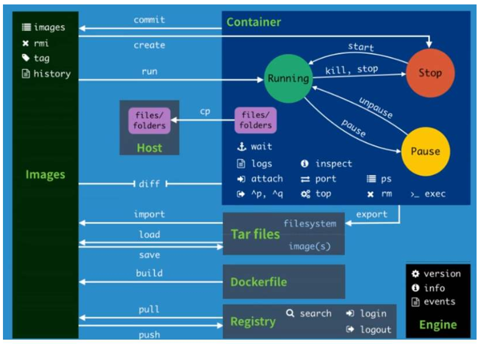

## 例：安装 Nginx

```shell
# 1、搜索镜像 或者去Docker Hub上搜索
docker search nginx

# 2、下载镜像
docker pull nginx

# 3、运行测试
# 		-d 后台运行
# 		--name 给容器命名
#		-p 宿主机端口:容器内端口
docker run -d --name nginx01 -p 3344:80 nginx

# 4、进入容器
docker exec -it nginx01 /bin/bash
whereis nginx
```

**端口暴露的概念**

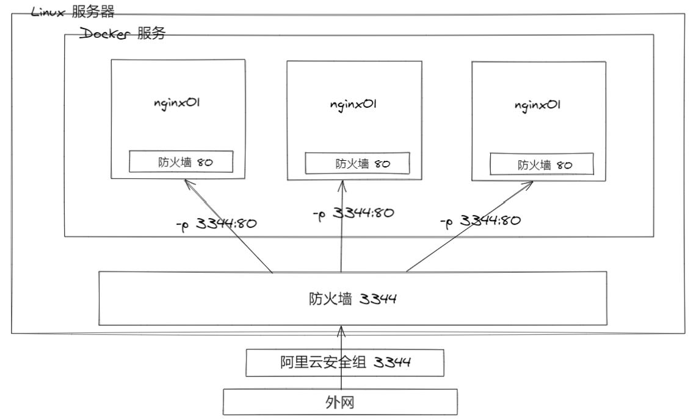

# Docker 镜像

## 镜像是什么

镜像是一种轻量级、可执行的独立软件包，用来打包软件运行环境和基于运行环境开发的软件，它包含运行某个软件所需的所有内容，包括代码、运行时的库、环境变量和配置文件。

## Docker镜像加载原理

> UnionFS（联合文件系统）

UnionFS（联合文件系统）：Union文件系统是一种分层，轻量级并且高性能的文件系统，它支持对文件系统的修改作为一次提交来一层层的叠加，同时可以将不同目录挂载到同一个虚拟文件系统下。Union文件系统是 Docker 镜像的基础。镜像可以通过分层来进行继承，基于基础镜像（没有父镜像），可以制作各种具体的应用镜像。

特性：一次同时加载多个文件系统，但从外面看来，只能看到一个文件系统，联合加载会把各层文件系统叠加起来，这样最终的文件系统会包含所有底层的文件和目录。


> Docker 镜像加载原理

docker 的镜像实际上是由一层一层的文件系统组成，这种层级的文件系统就是 UnionFS。

bootfs（boot file system）主要包含bootloader和kernel，bootloader主要是引导加载kernel，Linux刚启动时就会加载bootfs文件系统，在Docker镜像的最底层是bootfs。这一层与我们典型的Linux/Unix系统时一样的，包括boot加载器和内核。当boot加载完成之后整个内核就都在内存中了，此时内存的使用权转交给内核，此时系统也会卸载bootfs。

rootfs（root file system）在bootfs之上，包含的就是典型Linux系统的/dev，/prov，/bin，/etc等标准目录和文件。rootfs就是各种不同的操作系统发行版，比如Ubuntu，Centos等。

对于一个精简的OS，rootfs可以很小，只需要包含最基本的命令，工具和程序库就可以。因为底层直接用Host的Kernel，自己只需要提供rootfs就可以了。由此可见，对于不同的linux发行版，bootfs基本是一致的，rootfs会有差别，bootfs可以共用。

## 分层理解

> 分层的镜像

下载一个镜像时，注意观察下载的日志输出，可以看到是一层一层的在下载！

```shell
root@17:45:~ # docker pull redis
Using default tag: latest
latest: Pulling from library/redis
d121f8d1c412: Pull complete 
2f9874741855: Pull complete 
d92da09ebfd4: Pull complete 
bdfa64b72752: Pull complete 
e748e6f663b9: Pull complete 
eb1c8b66e2a1: Pull complete 
Digest: sha256:1cfb205a988a9dae5f025c57b92e9643ec0e7ccff6e66bc639d8a5f95bba928c
Status: Downloaded newer image for redis:latest
docker.io/library/redis:latest
```

思考：为什么Docker镜像要采用这种分层的结构呢？

最大的好处，资源共享。比如有多个镜像都从相同的Base镜像构建而来，那么宿主机只需在磁盘上保留一份Base镜像，同时内存中与只需要架子啊一份Base镜像，这样就可以为所有的容器服务了，而且镜像的每一层都可以被共享。

**查看镜像分层的方式可以通过以下命令实现：**

```shell
docker image inspect 镜像
root@17:47:~ # docker image inspect redis:latest
[
    {
        "Id": "sha256:84c5f6e03bf04e139705ceb2612ae274aad94f8dcf8cc630fbf6d91975f2e1c9",
        "RepoTags": [
            "redis:latest"
        ],
        "RepoDigests": [
            "redis@sha256:1cfb205a988a9dae5f025c57b92e9643ec0e7ccff6e66bc639d8a5f95bba928c"
        ],
        "Parent": "",
        "Comment": "",
        "Created": "2020-09-10T19:14:19.090647481Z",
        "Container": "01e8a1053cea8d8adc30b6f9c0e1d84a9c76535f6b0896c8fcff25d54c9c0429",
        "ContainerConfig": {
            "Hostname": "01e8a1053cea",
            "Domainname": "",
            "User": "",
            "AttachStdin": false,
            "AttachStdout": false,
            "AttachStderr": false,
            "ExposedPorts": {
                "6379/tcp": {}
            },
            "Tty": false,
            "OpenStdin": false,
            "StdinOnce": false,
            "Env": [
                "PATH=/usr/local/sbin:/usr/local/bin:/usr/sbin:/usr/bin:/sbin:/bin",
                "GOSU_VERSION=1.12",
                "REDIS_VERSION=6.0.8",
                "REDIS_DOWNLOAD_URL=http://download.redis.io/releases/redis-6.0.8.tar.gz",
                "REDIS_DOWNLOAD_SHA=04fa1fddc39bd1aecb6739dd5dd73858a3515b427acd1e2947a66dadce868d68"
            ],
            "Cmd": [
                "/bin/sh",
                "-c",
                "#(nop) ",
                "CMD [\"redis-server\"]"
            ],
            "ArgsEscaped": true,
            "Image": "sha256:194e5decbc63d8d28f685b6899326cc681b1e2265dd556d96ee12226400ca6d5",
            "Volumes": {
                "/data": {}
            },
            "WorkingDir": "/data",
            "Entrypoint": [
                "docker-entrypoint.sh"
            ],
            "OnBuild": null,
            "Labels": {}
        },
        "DockerVersion": "18.09.7",
        "Author": "",
        "Config": {
            "Hostname": "",
            "Domainname": "",
            "User": "",
            "AttachStdin": false,
            "AttachStdout": false,
            "AttachStderr": false,
            "ExposedPorts": {
                "6379/tcp": {}
            },
            "Tty": false,
            "OpenStdin": false,
            "StdinOnce": false,
            "Env": [
                "PATH=/usr/local/sbin:/usr/local/bin:/usr/sbin:/usr/bin:/sbin:/bin",
                "GOSU_VERSION=1.12",
                "REDIS_VERSION=6.0.8",
                "REDIS_DOWNLOAD_URL=http://download.redis.io/releases/redis-6.0.8.tar.gz",
                "REDIS_DOWNLOAD_SHA=04fa1fddc39bd1aecb6739dd5dd73858a3515b427acd1e2947a66dadce868d68"
            ],
            "Cmd": [
                "redis-server"
            ],
            "ArgsEscaped": true,
            "Image": "sha256:194e5decbc63d8d28f685b6899326cc681b1e2265dd556d96ee12226400ca6d5",
            "Volumes": {
                "/data": {}
            },
            "WorkingDir": "/data",
            "Entrypoint": [
                "docker-entrypoint.sh"
            ],
            "OnBuild": null,
            "Labels": null
        },
        "Architecture": "amd64",
        "Os": "linux",
        "Size": 104192177,
        "VirtualSize": 104192177,
        "GraphDriver": {
            "Data": {
                "LowerDir": "/var/lib/docker/overlay2/7ad559b616de8540bf88462236cd8a45343701a711264a1d975c68b5d2cef86f/diff:/var/lib/docker/overlay2/a6244a514b245e07760e8d703c64d178832c31b7b35751a73a385ff2bd009d05/diff:/var/lib/docker/overlay2/bcbac6f12038a6ef6c1a620b6f82229f2cc416b1f169d909d3d602733816a347/diff:/var/lib/docker/overlay2/ab8dc853b381caa845d9b3bea89994deedb586a9f11c72fd61bae26aa21f95a5/diff:/var/lib/docker/overlay2/99995f944243486884288150b0e8471026db5203f768ae9a58fc46f050ef077f/diff",
                "MergedDir": "/var/lib/docker/overlay2/5e0870f591bb7582d3d024a603b48f32a7b57492ef26544b7d4fc2c8aaa6e3f8/merged",
                "UpperDir": "/var/lib/docker/overlay2/5e0870f591bb7582d3d024a603b48f32a7b57492ef26544b7d4fc2c8aaa6e3f8/diff",
                "WorkDir": "/var/lib/docker/overlay2/5e0870f591bb7582d3d024a603b48f32a7b57492ef26544b7d4fc2c8aaa6e3f8/work"
            },
            "Name": "overlay2"
        },
        "RootFS": {
            "Type": "layers",
            "Layers": [
                "sha256:07cab433985205f29909739f511777a810f4a9aff486355b71308bb654cdc868",
                "sha256:45b5e221b6729773b50b4fc89e83a623f9f63ddf37e37078d5f197811db6177d",
                "sha256:7fb1fa4d4022ba2387d0df7820fa41c797eeda6f1192920da8cb99c6475dd9d1",
                "sha256:47d8fadc671445422662d5a25e09b2fabd2a77c7da4338ab3f817592fd60c84b",
                "sha256:ea96cbf71ac4d770813f8fd209a20ddb3b81c69992be2c0c3e1d1a4b9fb0da1a",
                "sha256:2e9c060aef92b6b958bee61fbf5f239443c629e6a62f1103c3ada7deb10aa543"
            ]
        },
        "Metadata": {
            "LastTagTime": "0001-01-01T00:00:00Z"
        }
    }
]
```

> 特点

Docker 镜像都是只读的，当容器启动时，一个新的可写层被加载到镜像的顶部。

这一层就是通常说的容器层，容器之下都是镜像层。

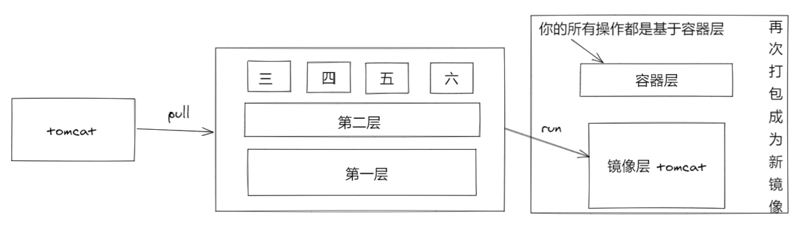

## commit镜像

```shell
# 命令和git原理类似
docker commit -m="提交的信息描述" -a="作者" 容器id 目标镜像名:[TAG]
```


# 容器数据卷

## 什么是容器数据卷

docker 的理念：将应用和环境打包成一个镜像！

数据？如果数据都在容器中，那么容器删除，将会导致数据的丢失！==需求：数据可以持久化==

MySQL，容器删了就相当于删库跑路了！==需求：MySQL的数据可以存储到本地==

容器之间可以有一个数据共享的技术！将Docker中产生的数据，同步到本地！

这就是卷技术！

简单理解就是，目录的挂载，将容器内的目录，挂载到Linux上面！

**总结一句话：容器的持久化和同步操作！容器间也是可以数据共享的！**


## 使用数据卷

> 方式一：直接使用命令来挂载 -v

```shell
docker run -it -v 宿主机目录:容器内目录
```

## 实战：安装MySQL

思考：MySQL 的数据持久化问题！

```shell
# 获取镜像
docker pull mysql:5.7

# 运行容器，需要做数据挂载（需要注意：配置密码）
# 官方测试：docker run --name some-mysql -e MYSQL_ROOT_PASSWORD=my-secret-pw -d mysql:tag

# 启动
docker run -d -p 3344:3306 -v /root/mysql/conf:/etc/mysql/conf.d -v /root/mysql/data:/var/lib/mysql -e MYSQL_ROOT_PASSWORD=888888 --name mysql01 mysql:5.7
```

## 具名和匿名挂载

```shell
# 匿名挂载
# 我们在 -v 挂载时只写了容器内的路径，没有写容器外的路径，这种就是匿名挂载
root@15:58:~/mysql # docker run -d -P --name nginx01 -v /etc/nginx nginx

# 查看所有的 volume 的情况
root@15:58:~/mysql # docker volume ls
DRIVER              VOLUME NAME
local               81ce29c3611bb0de23caa07c5956796615ce1f8d6927c6bd3c3be4c95e2710ac


# 具名挂载
# 通过 -v 卷名:卷内路径
root@15:58:~/mysql # docker run -d -P --name nginx02 -v juming_nginx:/etc/nginx nginx
d7575207001def4691786c06574d551d011065d0edb833f5b16bfad838c4ab62
root@16:03:~/mysql # docker volume ls
DRIVER              VOLUME NAME
local               81ce29c3611bb0de23caa07c5956796615ce1f8d6927c6bd3c3be4c95e2710ac
local               juming_nginx

# 查看一下这个卷（juming_nginx)
root@16:05:~/mysql # docker volume inspect juming_nginx
[
    {
        "CreatedAt": "2020-09-17T16:03:08+08:00",
        "Driver": "local",
        "Labels": null,
        "Mountpoint": "/var/lib/docker/volumes/juming_nginx/_data",
        "Name": "juming_nginx",
        "Options": null,
        "Scope": "local"
    }
]
```

所有的 Docker 容器内的卷，没有指定目录的情况下都是在`/var/lib/docker/volumes/xxxx/_data`下

我们通过具名挂载可以方便的找到我们的卷，通常情况下使用`具名挂载`

```shell
-v 容器内路径			   # 匿名挂载
-v 卷名:容器内路径			  # 具名挂载
-v /宿主机路径:容器内路径		# 指定路径挂载
```

**拓展：**

```shell
# 通过 -v 容器内路径:ro/rw 来改变读写权限
ro	# 只读
rw	# 可读可写

# 一旦设置了容器权限，容器对我们挂载出来的内容就有限定了
docker run -d -P --name nginx02 -v juming_nginx:/etc/nginx:ro nginx
docker run -d -P --name nginx02 -v juming_nginx:/etc/nginx:rw nginx

# ro 说明挂载的路径内容只能通过宿主机来操作，容器内无法操作
```


## 初始DockerFile

DockerFile 就是用来构建 docker 镜像的构建文件！命令脚本！

通过这个脚本可以生成镜像，镜像是一层一层的，脚本的每个命令就是一层！

```shell
# 创建dockerfile文件，文件中的内容：指令（大写） 参数
root@16:29:~ # cat DockerFile 
FROM centos

VOLUME ["volume01", "volume02"]

CMD echo "====[end]===="

CMD /bin/bash

# 构建镜像，这里的每个命令就是一层
root@16:30:~ # docker build -f /root/DockerFile -t my_centos:1.0 .
Sending build context to Docker daemon  620.3MB
Step 1/4 : FROM centos
latest: Pulling from library/centos
3c72a8ed6814: Pull complete 
Digest: sha256:76d24f3ba3317fa945743bb3746fbaf3a0b752f10b10376960de01da70685fbd
Status: Downloaded newer image for centos:latest
 ---> 0d120b6ccaa8
Step 2/4 : VOLUME ["volume01", "volume02"]
 ---> Running in a3e501f32e2d
Removing intermediate container a3e501f32e2d
 ---> 81b2f55b7432
Step 3/4 : CMD echo "====[end]===="
 ---> Running in 61a40f657afb
Removing intermediate container 61a40f657afb
 ---> 61e6738c9888
Step 4/4 : CMD /bin/bash
 ---> Running in 04c55fd300da
Removing intermediate container 04c55fd300da
 ---> 9b91faa94502
Successfully built 9b91faa94502
Successfully tagged my_centos:1.0

# 启动
root@16:31:~ # docker images
REPOSITORY          TAG                 IMAGE ID            CREATED             SIZE
my_centos           1.0                 9b91faa94502        4 minutes ago       215MB

root@16:36:~ # docker run -it 9b91faa94502 /bin/bash
[root@8a120c23454c /]# ls
bin  dev  etc  home  lib  lib64  lost+found  media  mnt  opt  proc  root  run  sbin  srv  sys  tmp  usr  var  volume01	volume02

# volume01 volume02 是我们构建镜像的时候自动挂载的（匿名挂载），因此宿主机一定有一个对应的目录
root@16:41:~ # docker inspect 9399446701df
[
    	...
    	
        "Mounts": [
            {
                "Type": "volume",
                "Name": "0d87b51d260c0ed19a91f5481a0140e347cff6e0d6a650999a855e29ec65677e",
                "Source": "/var/lib/docker/volumes/0d87b51d260c0ed19a91f5481a0140e347cff6e0d6a650999a855e29ec65677e/_data",
                "Destination": "volume01",
                "Driver": "local",
                "Mode": "",
                "RW": true,
                "Propagation": ""
            },
            {
                "Type": "volume",
                "Name": "1da3deec8684def28405c6c5e4a9b5cb719fb86c2ab8553f719e434cf5b67d70",
                "Source": "/var/lib/docker/volumes/1da3deec8684def28405c6c5e4a9b5cb719fb86c2ab8553f719e434cf5b67d70/_data",
                "Destination": "volume02",
                "Driver": "local",
                "Mode": "",
                "RW": true,
                "Propagation": ""
            }
        ],
        
        ...
]
```

## 数据卷容器

多个 MySQL 同步数据！

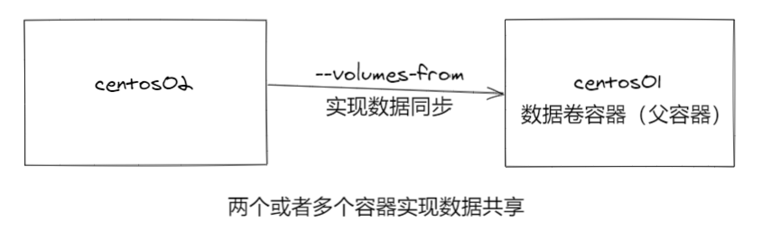

```shell
# 使用刚刚生成的镜像来创建容器，--volumes-from 同步数据，docker01 就是数据卷容器
# volume01 volume02 两个目录对于三个容器来说是共享的（双向拷贝）
# 此时即使docker01被删除，docker02和docker03中的数据不会丢失
root@17:08:~ # docker run -it --name docker01 9b91faa94502
root@17:10:~ # docker run -it --name docker02 --volumes-from docker01 9b91faa94502
root@17:10:~ # docker run -it --name docker03 --volumes-from docker01 9b91faa94502
```

**结论：**

容器之间配置信息的传递；数据卷容器的生命周期一直持续到没有容器使用为止。

但是一旦持久化到本地，本地的数据是不会被删除的。


# DockerFile

## 介绍

DockerFile 使用来构建 Docker 镜像的文件！命令参数脚本！

**构建步骤：**

1. 编写一个DockerFile 文件
   1. docker build 构建成为一个镜像
   2. docker run 运行镜像
   3. docker push 发布镜像（DockerHub，阿里云镜像库）

## DockerFile 构建过程

**基础知识**

1. 每个保留关键字（指令）都必须是大写
2. 从上到下顺序执行
3. \# 表示注释
4. 每一个指定都会创建一个新的镜像层，并提交！

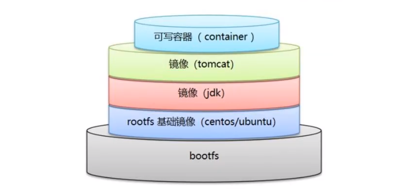

**步骤：开发，部署，运维**

DockerFile：构建文件，定义了一切的步骤，源代码。

DockerImages：通过 DockerFile 构建生成的镜像，最终发布和运行的产品。

DockerContainer：容器就是镜像运行起来提供服务。

## DockerFile 指令

```shell
FROM		# 基础镜像，一切从这里开始构建
MAINTAINER	# 镜像是谁写的，姓名+邮箱
RUN			# 镜像构建的时候需要运行的命令
ADD			# 添加内容
WORKDIR		# 镜像的工作目录
VOLUME		# 挂载的目录
EXPOSE		# 暴露端口配置
CMD			# 指定这个容器启动的时候要运行的命令，只有最后一个会生效，可被替代
ENTRYPOINT	# 指定这个容器启动的时候要运行的命令，可以追加指令
ONBUILD		# 当构建一个被继承的 DockerFile 这个时候就会运行 ONBUILD 指令。触发指令
COPY		# 类似ADD，将文件拷贝到镜像中
ENV			# 构建的时候设置环境变量
```

## 实战测试

DockerHub 的 99% 镜像都是从这个基础镜像过来的 `FROM scratch`，然后添加需要的软件和配置来进行构建

```dockerfile
# centos7 官方的dockerfile
FROM scratch
ADD centos-7-x86_64-docker.tar.xz /

LABEL \
    org.label-schema.schema-version="1.0" \
    org.label-schema.name="CentOS Base Image" \
    org.label-schema.vendor="CentOS" \
    org.label-schema.license="GPLv2" \
    org.label-schema.build-date="20200809" \
    org.opencontainers.image.title="CentOS Base Image" \
    org.opencontainers.image.vendor="CentOS" \
    org.opencontainers.image.licenses="GPL-2.0-only" \
    org.opencontainers.image.created="2020-08-09 00:00:00+01:00"

CMD ["/bin/bash"]
```

> 创建一个自己的centos

```shell
# 1、编写 DockerFile 文件
root@18:01:~/docker # cat dockerfile 
FROM centos
MAINTAINER fuck<2357489835@qq.com>

ENV MYPATH /usr/local
WORKDIR $MYPATH

RUN yum -y install vim

EXPOSE 80

CMD echo $MYPATH
CMD echo "=====end====="
CMD /bin/bash

# 2、通过这个文件构建镜像
# 	 docker build -f dockerfile路径 -t 镜像名:[tag]
root@18:03:~/docker # docker build -f /root/docker/dockerfile -t fuck_centos:0.1 .

# 测试：当前工作目录为/usr/local，存在vim编辑器，echo $MYPATH
root@18:06:~/docker # docker run -it fuck_centos:0.1
```

> CMD 和 ENTRYPOINT 区别

```shell
CMD			# 指定这个容器启动的时候要运行的命令，只有最后一个会生效，可被替代
ENTRYPOINT	# 指定这个容器启动的时候要运行的命令，可以追加指令
```

## 发布镜像

> DockerHub / 阿里云镜像服务

```shell
root@13:26:~ # docker login --help

Usage:	docker login [OPTIONS] [SERVER]

Log in to a Docker registry.
If no server is specified, the default is defined by the daemon.

Options:
  -p, --password string   Password
      --password-stdin    Take the password from stdin
  -u, --username string   Username
  
# docker push   # 一定要带标签
```

## 小结

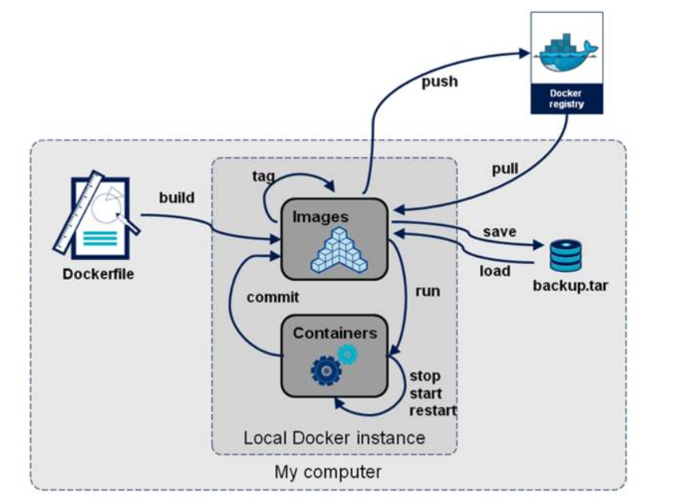


# Docker 网络

## 理解 Docker0

> 测试

```shell
root@13:26:~ # ip addr
1: lo: <LOOPBACK,UP,LOWER_UP> mtu 65536 qdisc noqueue state UNKNOWN group default qlen 1000
    link/loopback 00:00:00:00:00:00 brd 00:00:00:00:00:00
    inet 127.0.0.1/8 scope host lo		### 本机回环地址
       valid_lft forever preferred_lft forever
2: eth0: <BROADCAST,MULTICAST,UP,LOWER_UP> mtu 1500 qdisc pfifo_fast state UP group default qlen 1000
    link/ether 00:16:3e:03:d4:59 brd ff:ff:ff:ff:ff:ff
    inet 172.26.226.109/20 brd 172.26.239.255 scope global dynamic eth0		### 阿里云内网地址
       valid_lft 303097174sec preferred_lft 303097174sec
3: docker0: <NO-CARRIER,BROADCAST,MULTICAST,UP> mtu 1500 qdisc noqueue state DOWN group default 
    link/ether 02:42:4c:dd:8f:04 brd ff:ff:ff:ff:ff:ff
    inet 172.17.0.1/16 brd 172.17.255.255 scope global docker0			### docker0 地址
       valid_lft forever preferred_lft forever
```

```shell
# 运行两个docker容器
root@15:28:~ # docker run -it -P --name centos01 centos
root@15:28:~ # docker run -it -P --name centos02 centos

# 在本机ip addr 会发现多出了两张网卡
root@15:30:~ # ip addr
...
3: docker0: <BROADCAST,MULTICAST,UP,LOWER_UP> mtu 1500 qdisc noqueue state UP group default 
    link/ether 02:42:4c:dd:8f:04 brd ff:ff:ff:ff:ff:ff
    inet 172.17.0.1/16 brd 172.17.255.255 scope global docker0
       valid_lft forever preferred_lft forever
43: veth4d49e43@if42: <BROADCAST,MULTICAST,UP,LOWER_UP> mtu 1500 qdisc noqueue master docker0 state UP 
    link/ether 72:79:18:83:90:8b brd ff:ff:ff:ff:ff:ff link-netnsid 0
47: vethd0e8202@if46: <BROADCAST,MULTICAST,UP,LOWER_UP> mtu 1500 qdisc noqueue master docker0 state UP 
    link/ether 02:28:be:a7:e7:3e brd ff:ff:ff:ff:ff:ff link-netnsid 1

# 容器内部 ip addr，网卡与本机多出的两张网卡一一对应
root@15:30:~ # docker exec -it centos01 ip addr
...
       valid_lft forever preferred_lft forever
42: eth0@if43: <BROADCAST,MULTICAST,UP,LOWER_UP> mtu 1500 qdisc noqueue state UP group default 
    link/ether 02:42:ac:11:00:02 brd ff:ff:ff:ff:ff:ff link-netnsid 0
    inet 172.17.0.2/16 brd 172.17.255.255 scope global eth0
       valid_lft forever preferred_lft forever
root@15:33:~ # docker exec -it centos02 ip addr
...
46: eth0@if47: <BROADCAST,MULTICAST,UP,LOWER_UP> mtu 1500 qdisc noqueue state UP group default 
    link/ether 02:42:ac:11:00:03 brd ff:ff:ff:ff:ff:ff link-netnsid 0
    inet 172.17.0.3/16 brd 172.17.255.255 scope global eth0
       valid_lft forever preferred_lft forever

# linux 本机可以ping通容器内部，容器之间也可以互相ping，此时linux充当路由器的作用来进行转发
root@15:38:~ # ping 172.17.0.2
root@15:41:~ # ping 172.17.0.3
root@15:41:~ # docker exec -it centos01 ping 172.17.0.3
```

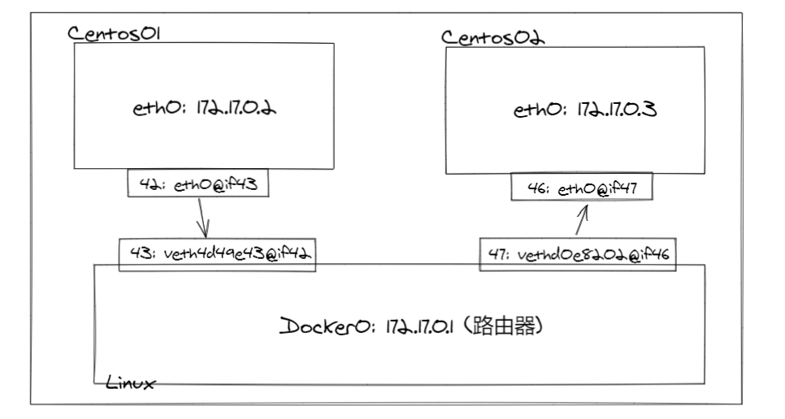

## --link

```shell
# 通过--link，在启动容器的时候，在/etc/hosts中添加一个映射，从而使用 ping+容器名 可以ping通
root@16:12:~ # docker run -it -P --name centos03 --link centos02 centos
[root@2d0f12fcb3dc /]# ping centos02
PING centos02 (172.17.0.3) 56(84) bytes of data.
64 bytes from centos02 (172.17.0.3): icmp_seq=1 ttl=64 time=0.094 ms
64 bytes from centos02 (172.17.0.3): icmp_seq=2 ttl=64 time=0.067 ms
```

## 自定义网络

```shell
# 查看所有的docker网络
root@16:16:~ # docker network ls
NETWORK ID          NAME                DRIVER              SCOPE
fa1185c12269        bridge              bridge              local
73fdb2fac0e1        host                host                local
d4cef0c91ebf        none                null                local
```

**网络模式**

bridge：桥接模式，docker默认！

none：不配置网络！

host：和宿主机共享网络！

container：容器内网络连通！

**测试**

```shell
# 直接使用启动命令默认带有参数 --net bridge，也是就docker0
root@16:30:~ # docker run -it -P --name test-centos centos
root@16:30:~ # docker run -it -P --name test-centos --net bridge centos

# docker0 特点：默认不能使用域名访问，可以使用--link来打通连接！
# 也可以自定义一个自己的网络
root@16:33:~ # docker network create --driver bridge --subnet 192.168.0.0/16 --gateway 192.168.0.1 mynet

root@16:35:~ # docker network ls
root@16:35:~ # docker network inspect mynet

# 启动两个容器，并查看
root@16:37:~ # docker run -it -P --name centos-net01 --net mynet centos
root@16:37:~ # docker run -it -P --name centos-net02 --net mynet centos
root@16:38:~ # docker network inspect mynet

# 自定义的网络是可以通过域名直接访问的
root@16:39:~ # docker exec -it centos-net01 ping centos-net02
root@16:40:~ # docker exec -it centos-net01 ping 192.168.0.3
```


## 网络连通

```shell
root@16:37:~ # docker run -it -P --name centos-net01 --net mynet centos      //192.168.0.2
root@16:37:~ # docker run -it -P --name centos-net02 --net mynet centos      //192.168.0.3
root@16:50:~ # docker run -it --name centos01 centos						 //172.17.0.2

## ping 不通
root@16:51:~ # docker exec -it centos01 ping 192.168.0.2

## 将centos01 和mynet 打通
## centos01容器将会拥有两个ip（容器和网卡进行打通，网卡和网卡是不能打通的）
root@16:55:~ # docker network connect mynet centos01
root@16:55:~ # docker exec -it centos01 ping 192.168.0.2
root@16:56:~ # docker network inspect mynet
```

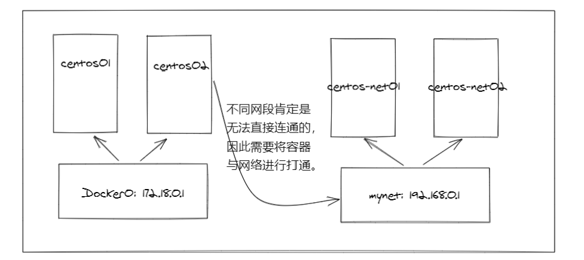


# Docker Compose


# Docker Swarm


# CI/CD 之 Jenkins


