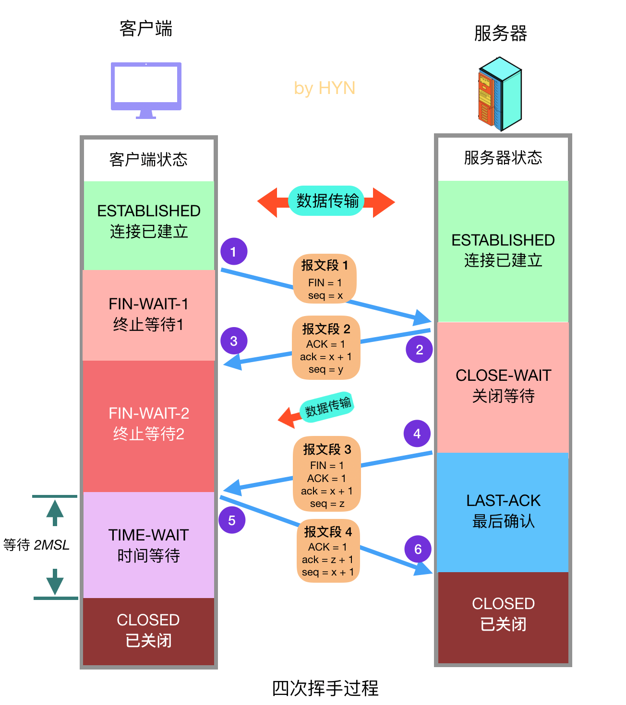

### 大量CLOSE_WAIT探究

**0. 没有调用close()**

```shell
由TCP四次挥手的状态流转图可知，产生COLSE_WAIT的最终原因：没有调用close()函数(CLOSE_WAIT就是在等待调用close()系统调用)。
为什么没有调用close()函数，可以总结为以下几点：
```

**1. 代码BUG**

```shell
代码忘记调用close()函数，或者代码不严谨出现死循环，导致永远不会执行close()函数。
```

**2. timeout值不合理**

```shell
此处的timeout指客户端发起请求时设置的请求超时时间。
该情况下，如果客户端和服务器协商不够恰当，timeout值的过小，客户端可能因为请求超时主动关闭连接，而此时服务器正忙于处理耗时的逻辑，不能及时调用close()关闭连接，导致CLOSE_WAIT大量堆积。
首要问题是响应太慢，也有可能是因为timeout值设置过小。
```

**3. BACKLOG太大**

```shell
背景：
	服务器接收到连接请求后，该连接会进入到SYN_RECV状态，并且被放入半连接队列中。
	可通过以下命令查看半连接队列大小：cat /proc/sys/net/ipv4/tcp_max_syn_backlog
	
	三次握手一旦结束，进入到ESTABLISHED状态，操作系统会将连接放入全连接队列中。
	全连接队列的大小除了和系统调用listen()相关外，还和系统参数有关：cat /proc/sys/net/core/somaxconn

原因：
	此处的BACKLOG，是指全连接队列的大小。在BACKLOG太大的情况下，同一时间接收到大量访问，即使服务器响应速度不慢，也可能会出现无法及时消费的情况，于是有些连接还在队列中就被客户端关闭了。但是此时服务器又在忙于处理其它请求，导致无法及时为大量已经关闭的连接调用close()，从而产生CLOSE_WAIT。
```

**参考文章**

<https://blog.huoding.com/2016/01/19/488>

<https://segmentfault.com/a/1190000022410446>


### 大量TIME_WAIT探究

**TIME_WAIT产生原因：**

```shell
1. 主动发起连接关闭请求
2. 接收到对方的FIN报文后，回复ACK，为了确保ACK对方能够正确接收，会等待一段时间（2MSL）。
```

**分析：**

```shell
大量TIME_WAIT的产生，可能是因为服务器主动关闭了大量的连接，通常为爬虫服务器或WEB服务器。
```

**解决方案（修改内核参数）：**

```shell
1. 快速回收TIME_WAIT连接占用的资源
2. 重用TIME_WAIT连接占用的资源


e.g. man tcp
  #开启重用，允许将处于TIME_WAIT的socket重新用于新的TCP连接，默认为0，表示关闭
  net.ipv4.tcp_tw_reuse = 1
  # 开启TCP连接中TIME_WAIT socket的快速回收，默认为0，表示关闭
  net.ipv4.tcp_tw_recycle = 1
  # 如果套接字由本端要求关闭，这个参数决定了它保持在FIN_WAIT2状态的时间
  net.ipv4.tcp_fin_timeout = 30
  # 表示系统同时保持TIME_WAIT套接字的最大数量，如果超过这个数字，TIME_WAIT套接字将立刻被清除并打印警告信息
  net.ipv4.tcp_max_tw_buckets = 5000
```

