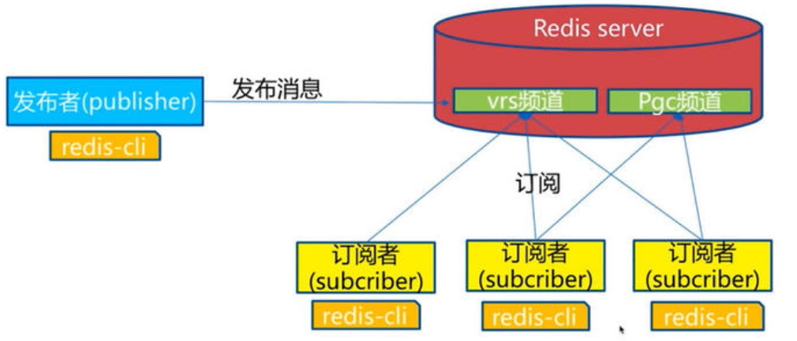

> Redis 发布订阅是一种消息通信模型，发送者发送消息，订阅者接收消息！
>
> Redis 客户端可以订阅任意数量的频道！

### 原理

```shell
Redis 通过 PUBLISH, SUBSCRIBE, PSUBSCRIBE 等命令实现发布的订阅功能！

通过 SUBSCRIBE 命令订阅某频道后，redis-server里维护了一个字典，字典的键就是一个个频道！而字典的值则是一个链表，链表中保存了所有订阅这个channel的客户端，SUBSCRIBE命令的关键就是将客户端添加到给定channel的订阅链表中！

通过PUBLISH命令向所有订阅者发送消息，redis-server会使用给定的频道作为键，在它所维护的channel字典中查找记录了订阅这个频道的所有客户端的链表，遍历这个链表，将消息发布给所有订阅者。
```

